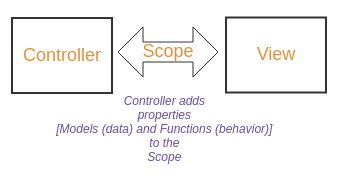

# Controllers

**Purpose**

The main purpose of a controller is to attach

* models
* functions containing business logic

to the scope as properties, so that they can be accessed in the views.
As the scope acts a binding between the controller and the view, the view can access the properties (models and functions) attached to the scope by the controller.




### Defining a controller

In AngularJS, a controller is registered on a *module* by calling the *controller()* function on the module instance and passing it

* the name of the controller (and)
* the definition of a constructor function that is instantiated by AngularJS when it encounters an *ng-controller* directive in HTML. The parameter names declared in the controller's constructor function indicate AngularJS about the controller's dependencies. AngularJS then creates new instances and injects them into the constructor parameters when instantiating the controller. This mechanism is referred to as Dependency Injection.

Example:

Defining a controller called "FirstController":

```javascript
angular.module('sampleApp', []).controller('FirstController', function($scope) {
  $scope.message = "Hello World!";
});
```

A module called "sampleApp" is defined with no dependencies.
A controller called "FirstController" is registered on the module by calling the *controller()* function and passing it

* the name of the controller "FirstController"
* a constructor function that is declared with a *$scope* parameter. When AngularJS encounters *ng-controller='FirstController'*, it creates a new *scope* instance and passes it as an argument to the controller function

### Controller dependencies

A controller can declare the services/objects that it depends on by providing their names as parameters to its constructor function.

```javascript
angular.module('sampleApp', []).controller('FirstController', function($scope, customService) {
  $scope.message = "Hello World!";
});
```

**$ Prefix: AngularJS services/objects**

AnglarJS follows a naming convention for the services and objects that it offers by prefixing their names with "$", so the names of any custom services/objects should not start with a "$".
